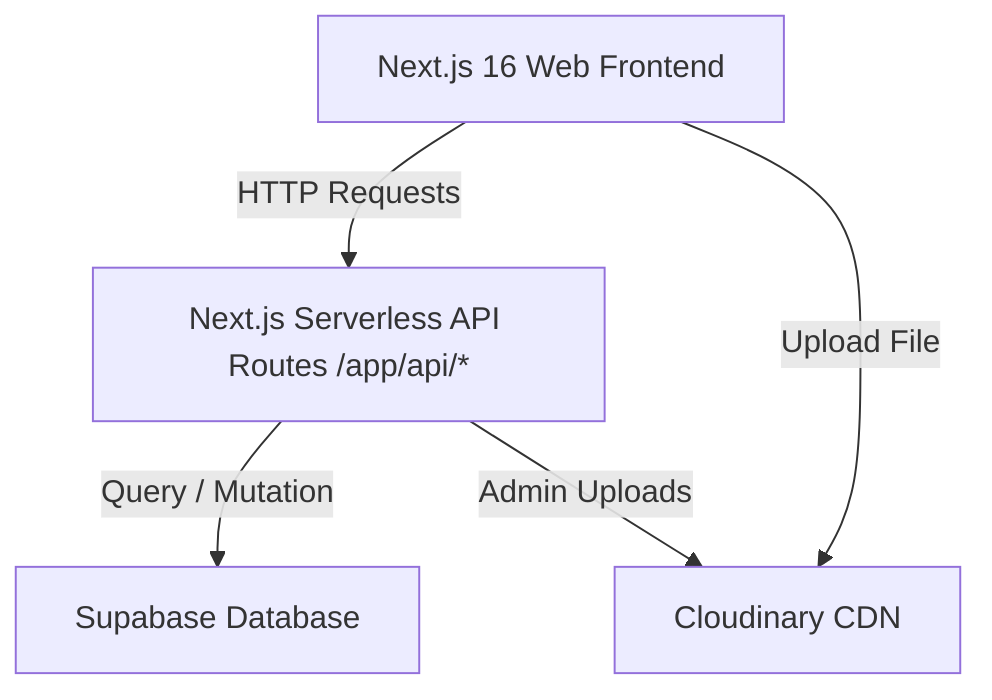

# Technical Architecture & Guidelines

This document outlines the system architecture, integration points, API specifications, and styling conventions of the Sree Nandanam School Website codebase.

---

## 🗺️ System Architecture Overview

The application follows a modern serverless model combining frontend rendering, API endpoints, and a database layer:



1.  **Frontend Layouts & Hydration**: Client components use React 19 hooks and Intersection Observers to trigger micro-animations (`hooks/use-scroll-animation.ts`).
2.  **API Middle Layer**: All page interactions with data (e.g., student search, submitting resumes) route through Next.js serverless route handlers (`/app/api/...`), shielding the raw Supabase URL and keeping database interactions safe and unified.
3.  **Media CDN Delivery**: Media files and submitted resumes are hosted via Cloudinary, ensuring fast delivery and responsive processing.

---

## 📡 API Route Reference

### 1. Student Details Lookup
*   **Path**: `GET /api/students`
*   **Query Parameters**:
    *   `id` or `studentid` (string, optional) - If provided, fetches details for that specific student. Otherwise, fetches all active students.
*   **Behavior**: Searches the `students` table utilizing case-insensitive partial checks (`ilike`) on the `studentid` field. Integrates joins across `student_enrollments`, `classes`, and `academic_years`.
*   **Example Response (Success)**:
    ```json
    {
      "success": true,
      "data": {
        "id": "uuid-here",
        "admission_no": "1024",
        "full_name": "John Doe",
        "studentid": "STUDENT1024",
        "classes": {
          "class_name": "Grade 5",
          "section": "A"
        },
        "academic_years": {
          "name": "2025-2026"
        }
      }
    }
    ```

### 2. Teacher Details Lookup
*   **Path**: `GET /api/teachers`
*   **Query Parameters**:
    *   `id` (string, required) - Matches custom `teacherid` or UUID.
*   **Behavior**: Looks up staff records using a case-insensitive lookup on the `teacherid` column in the `teachers` table.
*   **Example Response (Success)**:
    ```json
    {
      "success": true,
      "data": {
        "id": "uuid-here",
        "teacherid": "STAFF302",
        "full_name": "Sarah Smith",
        "designation": "Mathematics Head"
      }
    }
    ```

### 3. Careers Application
*   **Path**: `POST /api/careers`
*   **Payload (Multipart Form Data)**:
    *   `name` (string, required)
    *   `email` (string, required)
    *   `phone` (string, required)
    *   `coverLetter` (string, optional)
    *   `resume` (File/PDF, required)
*   **Behavior**: Streams the file upload straight to Cloudinary, grabs the secure URL, and registers a record into the `careers` table on Supabase.

---

## 🎨 Styling & Printing Guidelines

### 🛠️ Tailwind CSS v4 & Theme System
*   **Global Styling**: Defined in `/app/globals.css` and imports. Uses CSS Variables for theme colors (`--primary`, `--background`, `--foreground`, `--muted`, `--card`).
*   **Micro-Animations**: Scroll-based animations are controlled by combining Intersection Observers (`hooks/use-scroll-animation.ts`) with custom utility transitions:
    ```tsx
    const [isVisible, setIsVisible] = useState(false);
    // ... setup observer ...
    <div className={cn("transition-all duration-700", isVisible ? "opacity-100 translate-y-0" : "opacity-0 translate-y-4")} />
    ```

### 🖨️ Printer-Friendly Layouts
Student and Teacher ID profiles (`app/s/id-card/...`) are specifically styled for instant desktop printing.
*   **Print Utilities**: Uses standard Tailwind `print:` classes to hide controls, borders, and buttons during window print operations.
*   **Print Directive**:
    ```html
    <button onClick={() => window.print()} className="print:hidden">Print</button>
    ```
*   **Layout Constraints**: Cards use explicit maximum widths (`max-w-4xl`) and clean border separations to fit standard document dimensions perfectly.
